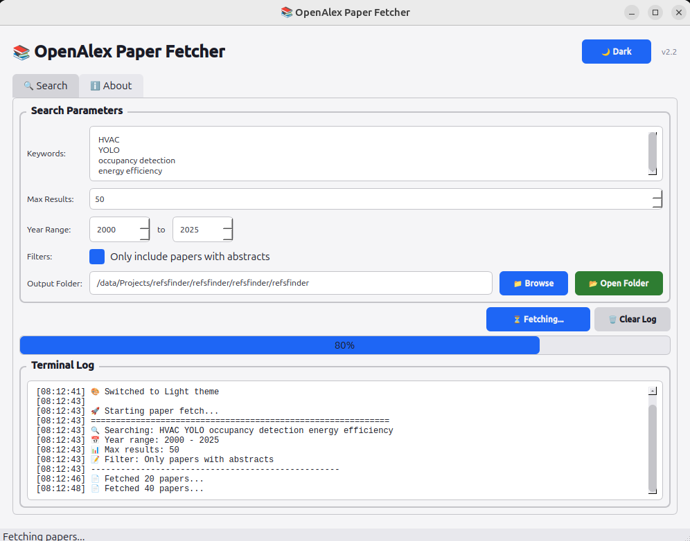
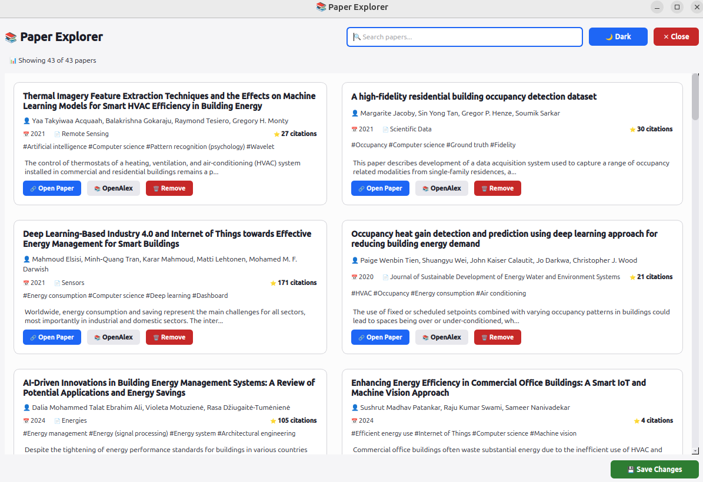

# 📚 OpenAlex Paper Fetcher v1.0

<p align="center">
  
</p>

<p align="center">
  
</p>


---

## 📖 เกี่ยวกับโปรแกรม

OpenAlex Paper Fetcher เป็นเครื่องมือ GUI ที่ใช้สำหรับค้นหาและดาวน์โหลดข้อมูลบทความวิชาการจากฐานข้อมูล [OpenAlex](https://openalex.org/) โดยสามารถกรองข้อมูลตามปีที่ตีพิมพ์ และเลือกได้เฉพาะบทความที่มีบทคัดย่อ (Abstract) เท่านั้น

โปรแกรมนี้ถูกออกแบบมาเพื่อช่วยนักวิจัยและนักวิชาการในการรวบรวมและจัดการเอกสารอ้างอิงสำหรับงานวิจัย โดยมีฟีเจอร์ที่ทันสมัยและใช้งานง่าย

---

## ✨ คุณสมบัติเด่น

### 🔍 การค้นหาและกรองข้อมูล
- **ค้นหาบทความ** ด้วยคำสำคัญหลายคำ (ทีละบรรทัด)
- **กรองตามช่วงปีที่ตีพิมพ์** (ค.ศ. 1900-2026)
- **กรองเฉพาะบทความที่มีบทคัดย่อ** (Abstract) เพื่อคุณภาพที่ดีขึ้น

### 🎨 การแสดงผล
- **รองรับธีมสีสว่าง/สีมืด** (Light/Dark Theme) ปรับเปลี่ยนได้ง่าย
- **แสดงความคืบหน้าแบบ Real-time** ขณะดาวน์โหลดข้อมูล
- **หน้าต่างแสดงผลแบบการ์ด** (Paper Explorer) สวยงาม ทันสมัย

### 📂 การจัดการไฟล์
- **เลือกโฟลเดอร์ปลายทาง** ได้เอง
- **เปิดโฟลเดอร์** ได้ด้วยปุ่มเดียว
- **บันทึกข้อมูลในหลายรูปแบบ** (BibTeX, JSON, Excel, Markdown)

### 🗑️ การจัดการเอกสาร
- **ลบเอกสารที่ไม่ต้องการ** ออกจากคอลเลกชัน
- **บันทึกการเปลี่ยนแปลง** และสร้างไฟล์ใหม่โดยอัตโนมัติ
- **โหลดเอกสารจาก JSON** เมื่อเปิดโปรแกรมใหม่

---

## 📁 ไฟล์ที่สร้างขึ้น

| ไฟล์ | คำอธิบาย |
|------|----------|
| `refs.bib` | บรรณานุกรมแบบสะอาดสำหรับ Overleaf/LaTeX |
| `refs_abstract.bib` | บรรณานุกรมพร้อมบทคัดย่อเต็ม |
| `refs_full.bib` | ข้อมูลครบถ้วนพร้อมบทคัดย่อและคำสำคัญ |
| `refs_with_summary.bib` | บรรณานุกรมพร้อมบทสรุปที่สร้างโดย AI สำหรับ Aider |
| `papers.json` | ข้อมูลเมตาครบถ้วนจาก OpenAlex |
| `papers.xlsx` | สเปรดชีตสำหรับกรองและจัดเรียงข้อมูล |
| `abstracts.md` | บันทึกบทคัดย่อสำหรับการทบทวนวรรณกรรม |

---

## 🖥️ ภาพหน้าจอ

### หน้าหลัก - ค้นหาและตั้งค่า


*หน้าต่างหลักสำหรับค้นหา ตั้งค่าการกรอง และดูสถานะการทำงาน*

### ตัวแสดงผลเอกสาร (Paper Explorer)


*หน้าต่างแสดงผลเอกสารแบบการ์ด พร้อมฟีเจอร์ค้นหา ลบ และบันทึกการเปลี่ยนแปลง*

---

## 🚀 วิธีติดตั้งและใช้งาน

### ความต้องการของระบบ
- Python 3.8 หรือสูงกว่า
- pip (ตัวจัดการแพ็คเกจ Python)

### ขั้นตอนการติดตั้ง

```bash
# 1. Clone repository
git clone https://github.com/komkritc/refsfinder.git
cd refsfinder

# 2. สร้าง Virtual Environment (แนะนำ)
python -m venv venv
source venv/bin/activate  # Linux/Mac
# หรือ
venv\Scripts\activate     # Windows

# 3. ติดตั้ง dependencies
pip install -r requirements.txt

# 4. รันโปรแกรม
python mainGUI.py
